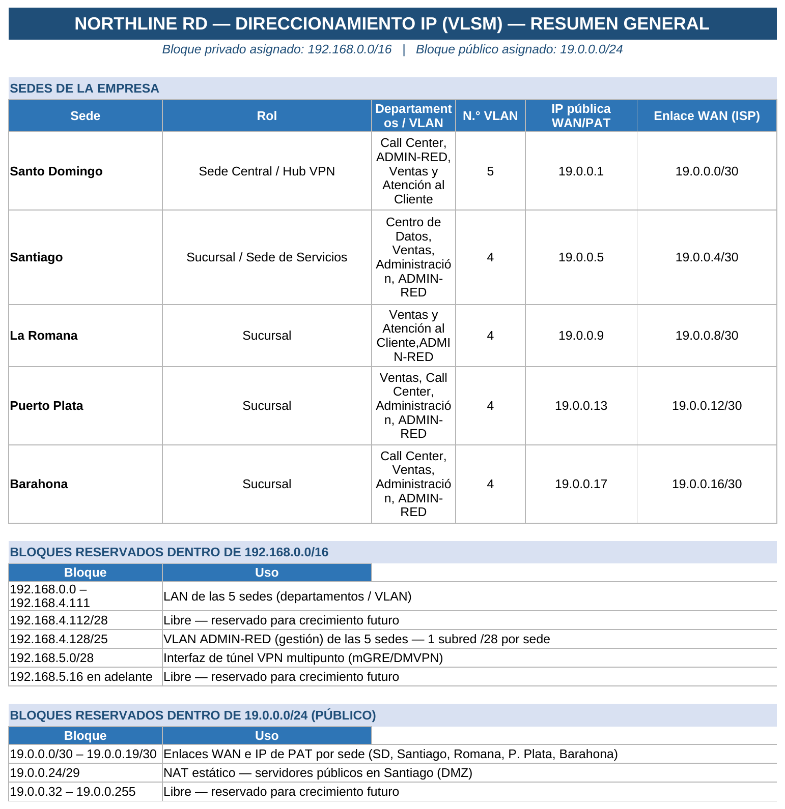
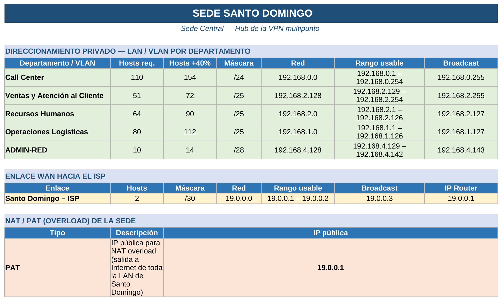
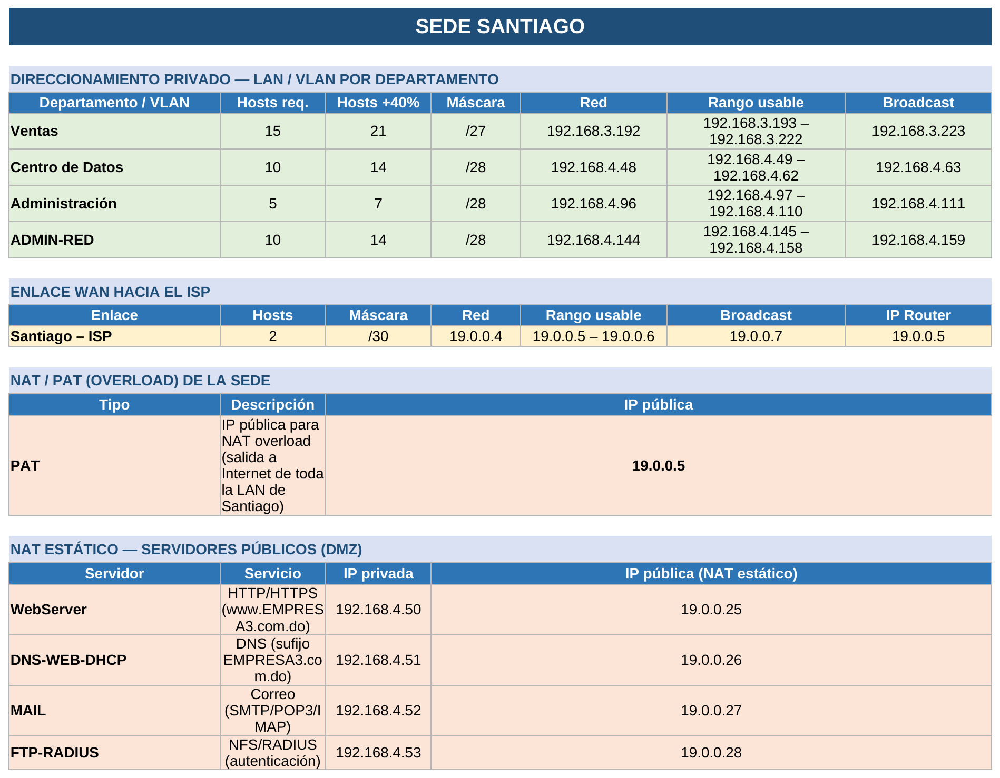
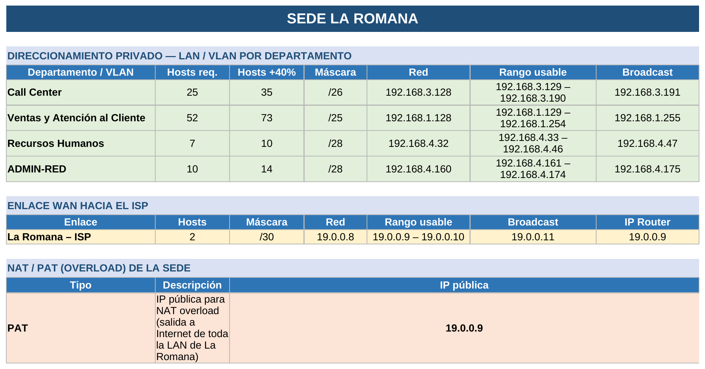
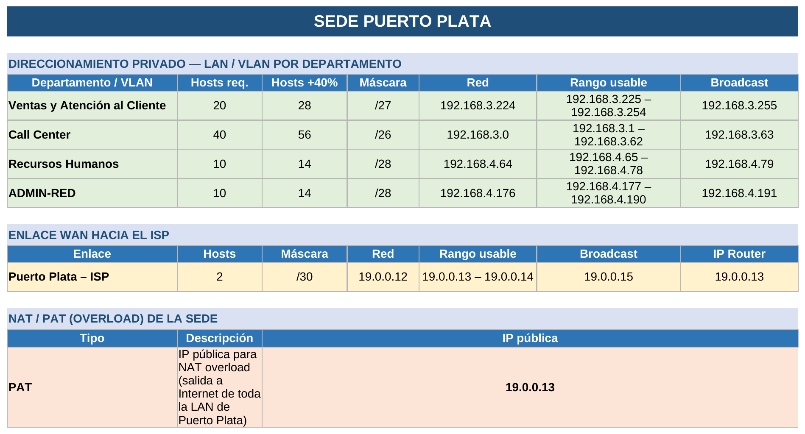
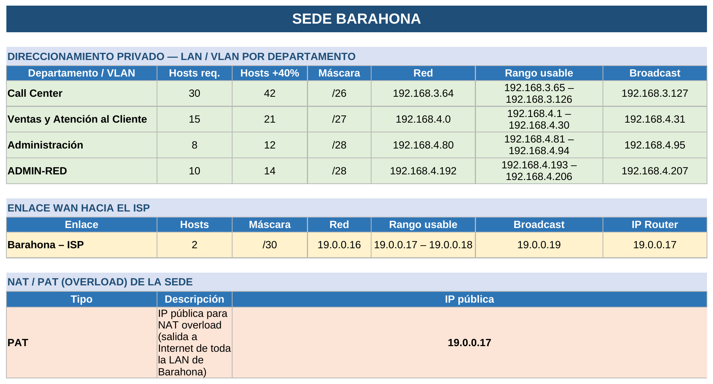
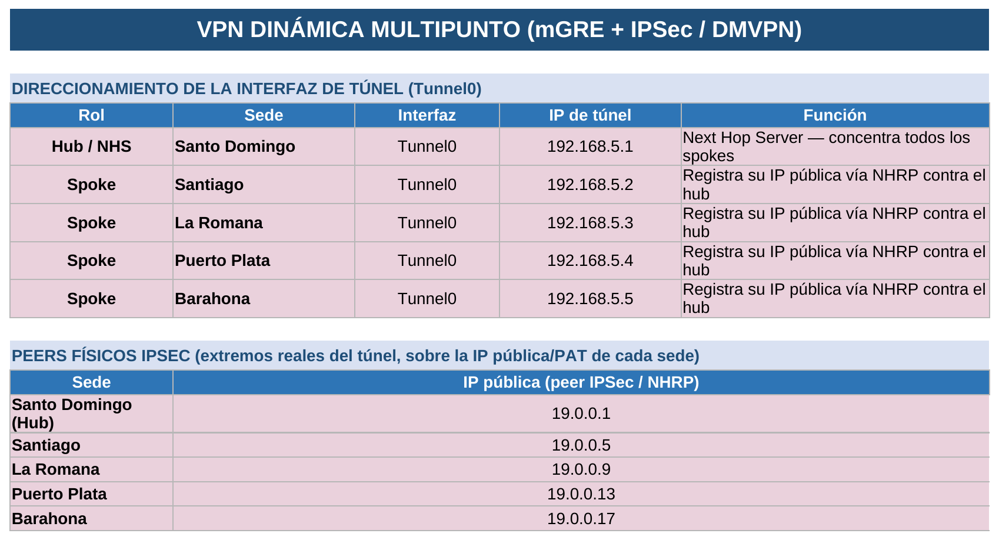

# NORTHLINE RD — Direccionamiento IP (VLSM)

**Bloque privado asignado:** `192.168.0.0/16`
**Bloque público asignado:** `19.0.0.0/24`

---

## Resumen general

Ver tabla en texto (Resumen general)

### Sedes de la empresa

<table>
<tr><th>Sede</th><th>Rol</th><th>Departamentos / VLAN</th><th>N.° VLAN</th><th>IP pública WAN/PAT</th><th>Enlace WAN (ISP)</th></tr>
<tr><td><b>Santo Domingo</b></td><td>Sede Central / Hub VPN</td><td>Call Center, ADMIN-RED, Ventas y Atención al Cliente</td><td align="center">5</td><td align="center">19.0.0.1</td><td align="center">19.0.0.0/30</td></tr>
<tr><td><b>Santiago</b></td><td>Sucursal / Sede de Servicios</td><td>Centro de Datos, Ventas, Administración, ADMIN-RED</td><td align="center">4</td><td align="center">19.0.0.5</td><td align="center">19.0.0.4/30</td></tr>
<tr><td><b>La Romana</b></td><td>Sucursal</td><td>Ventas y Atención al Cliente, ADMIN-RED</td><td align="center">4</td><td align="center">19.0.0.9</td><td align="center">19.0.0.8/30</td></tr>
<tr><td><b>Puerto Plata</b></td><td>Sucursal</td><td>Ventas, Call Center, Administración, ADMIN-RED</td><td align="center">4</td><td align="center">19.0.0.13</td><td align="center">19.0.0.12/30</td></tr>
<tr><td><b>Barahona</b></td><td>Sucursal</td><td>Call Center, Ventas, Administración, ADMIN-RED</td><td align="center">4</td><td align="center">19.0.0.17</td><td align="center">19.0.0.16/30</td></tr>
</table>

### Bloques reservados dentro de 192.168.0.0/16

<table>
<tr><th>Bloque</th><th>Uso</th></tr>
<tr><td>192.168.0.0 – 192.168.4.111</td><td>LAN de las 5 sedes (departamentos / VLAN)</td></tr>
<tr><td>192.168.4.112/28</td><td>Libre — reservado para crecimiento futuro</td></tr>
<tr><td>192.168.4.128/25</td><td>VLAN ADMIN-RED (gestión) de las 5 sedes — 1 subred /28 por sede</td></tr>
<tr><td>192.168.5.0/28</td><td>Interfaz de túnel VPN multipunto (mGRE/DMVPN)</td></tr>
<tr><td>192.168.5.16 en adelante</td><td>Libre — reservado para crecimiento futuro</td></tr>
</table>

### Bloques reservados dentro de 19.0.0.0/24 (público)

<table>
<tr><th>Bloque</th><th>Uso</th></tr>
<tr><td>19.0.0.0/30 – 19.0.0.19/30</td><td>Enlaces WAN e IP de PAT por sede (SD, Santiago, Romana, P. Plata, Barahona)</td></tr>
<tr><td>19.0.0.24/29</td><td>NAT estático — servidores públicos en Santiago (DMZ)</td></tr>
<tr><td>19.0.0.32 – 19.0.0.255</td><td>Libre — reservado para crecimiento futuro</td></tr>
</table>

---

## Sede Santo Domingo

*Sede Central — Hub de la VPN multipunto*

Ver tabla en texto (Santo Domingo)

**Direccionamiento privado — LAN / VLAN por departamento**

<table>
<tr><th>Departamento / VLAN</th><th>Hosts req.</th><th>Hosts +40%</th><th>Máscara</th><th>Red</th><th>Rango usable</th><th>Broadcast</th></tr>
<tr><td><b>Call Center</b></td><td align="center">110</td><td align="center">154</td><td align="center">/24</td><td>192.168.0.0</td><td>192.168.0.1 – 192.168.0.254</td><td>192.168.0.255</td></tr>
<tr><td><b>Ventas y Atención al Cliente</b></td><td align="center">51</td><td align="center">72</td><td align="center">/25</td><td>192.168.2.128</td><td>192.168.2.129 – 192.168.2.254</td><td>192.168.2.255</td></tr>
<tr><td><b>Recursos Humanos</b></td><td align="center">64</td><td align="center">90</td><td align="center">/25</td><td>192.168.2.0</td><td>192.168.2.1 – 192.168.2.126</td><td>192.168.2.127</td></tr>
<tr><td><b>Operaciones Logísticas</b></td><td align="center">80</td><td align="center">112</td><td align="center">/25</td><td>192.168.1.0</td><td>192.168.1.1 – 192.168.1.126</td><td>192.168.1.127</td></tr>
<tr><td><b>ADMIN-RED</b></td><td align="center">10</td><td align="center">14</td><td align="center">/28</td><td>192.168.4.128</td><td>192.168.4.129 – 192.168.4.142</td><td>192.168.4.143</td></tr>
</table>

**Enlace WAN hacia el ISP**

<table>
<tr><th>Enlace</th><th>Hosts</th><th>Máscara</th><th>Red</th><th>Rango usable</th><th>Broadcast</th><th>IP Router</th></tr>
<tr><td><b>Santo Domingo – ISP</b></td><td align="center">2</td><td align="center">/30</td><td>19.0.0.0</td><td>19.0.0.1 – 19.0.0.2</td><td>19.0.0.3</td><td align="center">19.0.0.1</td></tr>
</table>

**NAT / PAT (overload) de la sede**

<table>
<tr><th>Tipo</th><th>Descripción</th><th>IP pública</th></tr>
<tr><td><b>PAT</b></td><td>IP pública para NAT overload (salida a Internet de toda la LAN de Santo Domingo)</td><td align="center">19.0.0.1</td></tr>
</table>

---

## Sede Santiago

*Sucursal — Sede de Servicios*

Ver tabla en texto (Santiago)

**Direccionamiento privado — LAN / VLAN por departamento**

<table>
<tr><th>Departamento / VLAN</th><th>Hosts req.</th><th>Hosts +40%</th><th>Máscara</th><th>Red</th><th>Rango usable</th><th>Broadcast</th></tr>
<tr><td><b>Ventas</b></td><td align="center">15</td><td align="center">21</td><td align="center">/27</td><td>192.168.3.192</td><td>192.168.3.193 – 192.168.3.222</td><td>192.168.3.223</td></tr>
<tr><td><b>Centro de Datos</b></td><td align="center">10</td><td align="center">14</td><td align="center">/28</td><td>192.168.4.48</td><td>192.168.4.49 – 192.168.4.62</td><td>192.168.4.63</td></tr>
<tr><td><b>Administración</b></td><td align="center">5</td><td align="center">7</td><td align="center">/28</td><td>192.168.4.96</td><td>192.168.4.97 – 192.168.4.110</td><td>192.168.4.111</td></tr>
<tr><td><b>ADMIN-RED</b></td><td align="center">10</td><td align="center">14</td><td align="center">/28</td><td>192.168.4.144</td><td>192.168.4.145 – 192.168.4.158</td><td>192.168.4.159</td></tr>
</table>

**Enlace WAN hacia el ISP**

<table>
<tr><th>Enlace</th><th>Hosts</th><th>Máscara</th><th>Red</th><th>Rango usable</th><th>Broadcast</th><th>IP Router</th></tr>
<tr><td><b>Santiago – ISP</b></td><td align="center">2</td><td align="center">/30</td><td>19.0.0.4</td><td>19.0.0.5 – 19.0.0.6</td><td>19.0.0.7</td><td align="center">19.0.0.5</td></tr>
</table>

**NAT / PAT (overload) de la sede**

<table>
<tr><th>Tipo</th><th>Descripción</th><th>IP pública</th></tr>
<tr><td><b>PAT</b></td><td>IP pública para NAT overload (salida a Internet de toda la LAN de Santiago)</td><td align="center">19.0.0.5</td></tr>
</table>

**NAT estático — servidores públicos (DMZ)**

<table>
<tr><th>Servidor</th><th>Servicio</th><th>IP privada</th><th>IP pública (NAT estático)</th></tr>
<tr><td><b>WebServer</b></td><td>HTTP/HTTPS (www.EMPRESA3.com.do)</td><td>192.168.4.50</td><td align="center">19.0.0.25</td></tr>
<tr><td><b>DNS-WEB-DHCP</b></td><td>DNS (sufijo EMPRESA3.com.do)</td><td>192.168.4.51</td><td align="center">19.0.0.26</td></tr>
<tr><td><b>MAIL</b></td><td>Correo (SMTP/POP3/IMAP)</td><td>192.168.4.52</td><td align="center">19.0.0.27</td></tr>
<tr><td><b>FTP-RADIUS</b></td><td>NFS/RADIUS (autenticación)</td><td>192.168.4.53</td><td align="center">19.0.0.28</td></tr>
</table>

---

## Sede La Romana

Ver tabla en texto (La Romana)

**Direccionamiento privado — LAN / VLAN por departamento**

<table>
<tr><th>Departamento / VLAN</th><th>Hosts req.</th><th>Hosts +40%</th><th>Máscara</th><th>Red</th><th>Rango usable</th><th>Broadcast</th></tr>
<tr><td><b>Call Center</b></td><td align="center">25</td><td align="center">35</td><td align="center">/26</td><td>192.168.3.128</td><td>192.168.3.129 – 192.168.3.190</td><td>192.168.3.191</td></tr>
<tr><td><b>Ventas y Atención al Cliente</b></td><td align="center">52</td><td align="center">73</td><td align="center">/25</td><td>192.168.1.128</td><td>192.168.1.129 – 192.168.1.254</td><td>192.168.1.255</td></tr>
<tr><td><b>Recursos Humanos</b></td><td align="center">7</td><td align="center">10</td><td align="center">/28</td><td>192.168.4.32</td><td>192.168.4.33 – 192.168.4.46</td><td>192.168.4.47</td></tr>
<tr><td><b>ADMIN-RED</b></td><td align="center">10</td><td align="center">14</td><td align="center">/28</td><td>192.168.4.160</td><td>192.168.4.161 – 192.168.4.174</td><td>192.168.4.175</td></tr>
</table>

**Enlace WAN hacia el ISP**

<table>
<tr><th>Enlace</th><th>Hosts</th><th>Máscara</th><th>Red</th><th>Rango usable</th><th>Broadcast</th><th>IP Router</th></tr>
<tr><td><b>La Romana – ISP</b></td><td align="center">2</td><td align="center">/30</td><td>19.0.0.8</td><td>19.0.0.9 – 19.0.0.10</td><td>19.0.0.11</td><td align="center">19.0.0.9</td></tr>
</table>

**NAT / PAT (overload) de la sede**

<table>
<tr><th>Tipo</th><th>Descripción</th><th>IP pública</th></tr>
<tr><td><b>PAT</b></td><td>IP pública para NAT overload (salida a Internet de toda la LAN de La Romana)</td><td align="center">19.0.0.9</td></tr>
</table>

---

## Sede Puerto Plata

Ver tabla en texto (Puerto Plata)

**Direccionamiento privado — LAN / VLAN por departamento**

<table>
<tr><th>Departamento / VLAN</th><th>Hosts req.</th><th>Hosts +40%</th><th>Máscara</th><th>Red</th><th>Rango usable</th><th>Broadcast</th></tr>
<tr><td><b>Ventas y Atención al Cliente</b></td><td align="center">20</td><td align="center">28</td><td align="center">/27</td><td>192.168.3.224</td><td>192.168.3.225 – 192.168.3.254</td><td>192.168.3.255</td></tr>
<tr><td><b>Call Center</b></td><td align="center">40</td><td align="center">56</td><td align="center">/26</td><td>192.168.3.0</td><td>192.168.3.1 – 192.168.3.62</td><td>192.168.3.63</td></tr>
<tr><td><b>Recursos Humanos</b></td><td align="center">10</td><td align="center">14</td><td align="center">/28</td><td>192.168.4.64</td><td>192.168.4.65 – 192.168.4.78</td><td>192.168.4.79</td></tr>
<tr><td><b>ADMIN-RED</b></td><td align="center">10</td><td align="center">14</td><td align="center">/28</td><td>192.168.4.176</td><td>192.168.4.177 – 192.168.4.190</td><td>192.168.4.191</td></tr>
</table>

**Enlace WAN hacia el ISP**

<table>
<tr><th>Enlace</th><th>Hosts</th><th>Máscara</th><th>Red</th><th>Rango usable</th><th>Broadcast</th><th>IP Router</th></tr>
<tr><td><b>Puerto Plata – ISP</b></td><td align="center">2</td><td align="center">/30</td><td>19.0.0.12</td><td>19.0.0.13 – 19.0.0.14</td><td>19.0.0.15</td><td align="center">19.0.0.13</td></tr>
</table>

**NAT / PAT (overload) de la sede**

<table>
<tr><th>Tipo</th><th>Descripción</th><th>IP pública</th></tr>
<tr><td><b>PAT</b></td><td>IP pública para NAT overload (salida a Internet de toda la LAN de Puerto Plata)</td><td align="center">19.0.0.13</td></tr>
</table>

---

## Sede Barahona

Ver tabla en texto (Barahona)

**Direccionamiento privado — LAN / VLAN por departamento**

<table>
<tr><th>Departamento / VLAN</th><th>Hosts req.</th><th>Hosts +40%</th><th>Máscara</th><th>Red</th><th>Rango usable</th><th>Broadcast</th></tr>
<tr><td><b>Call Center</b></td><td align="center">30</td><td align="center">42</td><td align="center">/26</td><td>192.168.3.64</td><td>192.168.3.65 – 192.168.3.126</td><td>192.168.3.127</td></tr>
<tr><td><b>Ventas y Atención al Cliente</b></td><td align="center">15</td><td align="center">21</td><td align="center">/27</td><td>192.168.4.0</td><td>192.168.4.1 – 192.168.4.30</td><td>192.168.4.31</td></tr>
<tr><td><b>Administración</b></td><td align="center">8</td><td align="center">12</td><td align="center">/28</td><td>192.168.4.80</td><td>192.168.4.81 – 192.168.4.94</td><td>192.168.4.95</td></tr>
<tr><td><b>ADMIN-RED</b></td><td align="center">10</td><td align="center">14</td><td align="center">/28</td><td>192.168.4.192</td><td>192.168.4.193 – 192.168.4.206</td><td>192.168.4.207</td></tr>
</table>

**Enlace WAN hacia el ISP**

<table>
<tr><th>Enlace</th><th>Hosts</th><th>Máscara</th><th>Red</th><th>Rango usable</th><th>Broadcast</th><th>IP Router</th></tr>
<tr><td><b>Barahona – ISP</b></td><td align="center">2</td><td align="center">/30</td><td>19.0.0.16</td><td>19.0.0.17 – 19.0.0.18</td><td>19.0.0.19</td><td align="center">19.0.0.17</td></tr>
</table>

**NAT / PAT (overload) de la sede**

<table>
<tr><th>Tipo</th><th>Descripción</th><th>IP pública</th></tr>
<tr><td><b>PAT</b></td><td>IP pública para NAT overload (salida a Internet de toda la LAN de Barahona)</td><td align="center">19.0.0.17</td></tr>
</table>

---

## VPN dinámica multipunto (mGRE + IPSec / DMVPN)

Ver tabla en texto (VPN Multipunto)

**Direccionamiento de la interfaz de túnel (Tunnel0)**

<table>
<tr><th>Rol</th><th>Sede</th><th>Interfaz</th><th>IP de túnel</th><th>Función</th></tr>
<tr><td><b>Hub / NHS</b></td><td>Santo Domingo</td><td align="center">Tunnel0</td><td align="center">192.168.5.1</td><td>Next Hop Server — concentra todos los spokes</td></tr>
<tr><td><b>Spoke</b></td><td>Santiago</td><td align="center">Tunnel0</td><td align="center">192.168.5.2</td><td>Registra su IP pública vía NHRP contra el hub</td></tr>
<tr><td><b>Spoke</b></td><td>La Romana</td><td align="center">Tunnel0</td><td align="center">192.168.5.3</td><td>Registra su IP pública vía NHRP contra el hub</td></tr>
<tr><td><b>Spoke</b></td><td>Puerto Plata</td><td align="center">Tunnel0</td><td align="center">192.168.5.4</td><td>Registra su IP pública vía NHRP contra el hub</td></tr>
<tr><td><b>Spoke</b></td><td>Barahona</td><td align="center">Tunnel0</td><td align="center">192.168.5.5</td><td>Registra su IP pública vía NHRP contra el hub</td></tr>
</table>

**Peers físicos IPSec (extremos reales del túnel, sobre la IP pública/PAT de cada sede)**

<table>
<tr><th>Sede</th><th>IP pública (peer IPSec / NHRP)</th></tr>
<tr><td><b>Santo Domingo (Hub)</b></td><td align="center">19.0.0.1</td></tr>
<tr><td><b>Santiago</b></td><td align="center">19.0.0.5</td></tr>
<tr><td><b>La Romana</b></td><td align="center">19.0.0.9</td></tr>
<tr><td><b>Puerto Plata</b></td><td align="center">19.0.0.13</td></tr>
<tr><td><b>Barahona</b></td><td align="center">19.0.0.17</td></tr>
</table>

